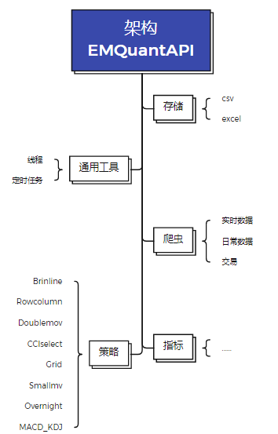

### EMQuantAPI Python使用

**项目地址**：https://github.com/linxinloningg/EMQuantAPI

开发源码：在量化接口官网（http://quantapi.eastmoney.com/）下载压缩包EmQuantAPI_Python.zip,下载完成后解压。其中：

* installEmQuantAPI.py用于注册python接口；

* libs含接口的库文件，以及接口登录激活工具文件，通过手机号获取验证码，自动生成令牌用以登录；

* demo.py为示例脚本文件

### 目录：

* 接口配置的系统环境要求与方法
* 接口代码使用框架
* 程序主体框架
* 另外

#### 1.接口配置的系统环境要求与方法

>**系统环境要求**
>
>Windows 系统，支持32位和64位系统，以及Microsoft Visual C++ 2010 可再发行组件包（可在电脑“程序和
>
>功能”中查看是否安装，下载链接如下）
>
>• 下载链接：http://choiceclub.eastmoney.com/#/articleDetail/8769
>
>•  仓库链接：[configure](https://github.com/linxinloningg/EMQuantAPI/tree/main/configure)
>
>Centos, Ubuntu，支持32位和64位系统；
>
>Mac OS 系统，支持64位系统，以及gtk+3.0环境（激活工具使用）
>
>Python版本： 2.6.x, 2.7.x, 3.x
>
>**配置方法**
>
>* 在命令行运行 [installEmQuantAPI.py](https://github.com/linxinloningg/EMQuantAPI/blob/main/installEmQuantAPI.py) 注册，若使用Anaconda编译器，请在编译器中运行
>
>installEmQuantAPI.py注册.
>
>* 绑定手机号,登录Choice量化接口网站主页（http://quantapi.eastmoney.com），点击右上角账户名-个人资料绑定手机号；或者登录Choice金融终端，进入用户中心-资料管理绑定手机号。
>
>* 接口注册成功后，使用[manualactive.py](https://github.com/linxinloningg/EMQuantAPI/blob/main/installEmQuantAPI.py) ](https://github.com/linxinloningg/EMQuantAPI/blob/main/manualactive.py)函数，修改并运行如下代码：
>
>  ```python
>  from EmQuantAPI import *
>  import platform
>  
>  # 手动激活范例(单独使用)
>  # 获取当前安装版本为x86还是x64
>  # 编辑日期：2018-09-29
>  data = platform.architecture()
>  
>  if data[0] == "64bit":
>      bit = "x64"
>  elif data[0] == "32bit":
>      bit = "x86"
>  
>  data1 = platform.system()
>  if data1 == 'Linux':
>      system1 = 'linux'
>      lj = c.setserverlistdir("libs/" + system1 + '/' + bit)
>  elif data1 == 'Windows':
>      system1 = 'windows'
>      lj = c.setserverlistdir("libs/" + system1)
>  elif data1 == 'Darwin':
>      system1 = 'mac'
>      lj = c.setserverlistdir("libs/" + system1)
>  else:
>      pass
>  #调用manualactive函数，修改账号、密码、有效邮箱地址，email=字样需保留
>  data = c.manualactivate("账号", "密码", "email=有效邮箱地址")
>  if data.ErrorCode != 0:
>      print("manualactivate failed, ", data.ErrorMsg)
>  ```
>
>为了方便，添加一个[json](https://github.com/linxinloningg/EMQuantAPI/blob/main/configure/config.json)文件用于配置：
>
>只需要将自己的信息添加进去再运行installEmQuantAPI.py即可：
>
>```json
>{
>  "manualactive": {
>    "user": "xxx-xxx-xxx-xx",
>    "password": "********",
>    "email": "xxxxxx@qq.com"
>  }
>```
>
>**登录函数**
>
>```python
># 调用登录函数（激活后使用，不需要用户名密码）
># start(options, logcallback, mainCallBack)
>loginResult = c.start("ForceLogin=1", '', mainCallback)
>```
>
>**退出函数**
>
>```python
># 退出
># stop ()
>data = logoutResult = c.stop()
>```

### 2.接口代码使用框架

```python
from EmQuantAPI import *
import traceback


def mainCallback(quantdata):
    """
    mainCallback 是主回调函数，可捕捉如下错误
    在start函数第三个参数位传入，该函数只有一个为c.EmQuantData类型的参数quantdata
    :param quantdata:c.EmQuantData
    :return:
    """
    print("mainCallback", str(quantdata))
    # 登录掉线或者 登陆数达到上线（即登录被踢下线） 这时所有的服务都会停止
    if str(quantdata.ErrorCode) == "10001011" or str(quantdata.ErrorCode) == "10001009":
        print("您的帐户已断开连接。如果需要，您可以在此处强制自动登录。")
    # 行情登录验证失败（每次连接行情服务器时需要登录验证）或者行情流量验证失败时，会取消所有订阅，用户需根据具体情况处理
    elif str(quantdata.ErrorCode) == "10001021" or str(quantdata.ErrorCode) == "10001022":
        print("您的所有csq订阅已停止。")
    # 行情服务器断线自动重连连续6次失败（1分钟左右）不过重连尝试还会继续进行直到成功为止，遇到这种情况需要确认两边的网络状况
    elif str(quantdata.ErrorCode) == "10002009":
        print("您的所有csq订阅已停止，重新连接6次失败。")
    # 行情订阅遇到一些错误(这些错误会导致重连，错误原因通过日志输出，统一转换成EQERR_QUOTE_RECONNECT在这里通知)，正自动重连并重新订阅,可以做个监控
    elif str(quantdata.ErrorCode) == "10002012":
        print("csq订阅在出现错误时中断，自动重新连接并请求。")
    # 资讯服务器断线自动重连连续6次失败（1分钟左右）不过重连尝试还会继续进行直到成功为止，遇到这种情况需要确认两边的网络状况
    elif str(quantdata.ErrorCode) == "10002014":
        print("您的所有cnq订阅已停止，重新连接6次失败。")
    # 资讯订阅遇到一些错误(这些错误会导致重连，错误原因通过日志输出，统一转换成EQERR_INFO_RECONNECT在这里通知)，正自动重连并重新订阅,可以做个监控
    elif str(quantdata.ErrorCode) == "10002013":
        print("cnq订阅在出现错误时中断，自动重新连接并请求。")
    # 资讯登录验证失败（每次连接资讯服务器时需要登录验证）或者资讯流量验证失败时，会取消所有订阅，用户需根据具体情况处理
    elif str(quantdata.ErrorCode) == "10001024" or str(quantdata.ErrorCode) == "10001025":
        print("您的所有cnq订阅已停止。")
    else:
        pass


def startCallback(message):
    print("[EmQuantAPI Python]", message)
    return 1


def csqCallback(quantdata):
    """
    csqCallback 是csq订阅时提供的回调函数模板。该函数只有一个为c.EmQuantData类型的参数quantdata
    :param quantdata:c.EmQuantData
    :return:
    """
    print("csqCallback,", str(quantdata))


def cstCallBack(quantdata):
    """
    cstCallBack 是日内跳价服务提供的回调函数模板
    """
    for i in range(0, len(quantdata.Codes)):
        length = len(quantdata.Dates)
        for it in quantdata.Data.keys():
            print(it)
            for k in range(0, length):
                for j in range(0, len(quantdata.Indicators)):
                    print(quantdata.Data[it][j * length + k], " ", end="")
                print()


def cnqCallback(quantdata):
    """
    cnqCallback 是cnq订阅时提供的回调函数模板。该函数只有一个为c.EmQuantData类型的参数quantdata
    :param quantdata:c.EmQuantData
    :return:
    """
    # print ("cnqCallback,", str(quantdata))
    print("cnqCallback,")
    for code in quantdata.Data:
        for k in range(0, len(quantdata.Data[code])):
            print(quantdata.Data[code][k])


try:
    # 调用登录函数（激活后使用，不需要用户名密码）
    loginResult = c.start("ForceLogin=1", '', mainCallback)
    if loginResult.ErrorCode != 0:
        print("login in fail")
        exit()
    """
    做任何你想做的事情
    """
    # 退出
    data = logoutResult = c.stop()
except Exception as ee:
    print("error >>>", ee)
    traceback.print_exc()
else:
    print("demo end")
```

### 3.程序主体框架：



#### 指标quota包含：

ma即为经过哟了移动平均处理

* ```
  人气意愿指标移动函数
  index_maarbp
  ```

* ```
  平均收益移动函数
  index_maavgprofit
  ```

* ```
  平均价格移动函数
  index_maavprice
  ```

* ```
  乖离率移动函数
  index_mabias
  ```

* ```
  布林线移动函数
  index_boll
  ```

* ```
  CCI顺势指标移动函数
  index_macci
  ```

* ```
  CR能量指标
  index_macr
  ```

* ```
  平行线差（DMA）指标
  index_madma
  ```

* ```
  动向指标或趋向指标
  index_dmi
  ```

* ```
  简单波段指标
  index_maemv
  ```

* ```
  价格波动范围指标
  index_maenv
  ```

* ```
  kdj随机指标
  index_kdj
  ```

* ```
  MA简单移动平均
  index_ma
  ```

* ```
  MACD指数平滑异同平均
  index_macd
  ```

* ```
  能量潮指标
  index_maobv
  ```

* ```
  PSY心理指标
  index_mapsy
  ```

* ```
  ROC变动速率
  index_maroc
  ```

* ```
  RSI相对强弱指标
  index_marsi
  ```

* ```
  TRIX三重指数平滑平均
  index_trix
  ```

* ```
  成交量指标
  index_mavol
  ```

* ```
  W&R威廉指标
  index_mawr
  ```

  **更多指标函数，可以通过[指标手册](https://github.com/linxinloningg/EMQuantAPI/blob/main/%E6%8C%87%E6%A0%87%E6%89%8B%E5%86%8CV2.5.3.0.CHM)配合http://quantapi.eastmoney.com/Cmd/ChoiceSerialSection?from=web东财命令生成网站构建**

  ### 4.另外：

  还有一个用于信息通知的企业微信机器人，需自己新建一个群，添加群机器人并获取到相关api接口，添加到[json](https://github.com/linxinloningg/EMQuantAPI/blob/main/configure/config.json)配置文件即可：

  ```json
  "qywechat": {
    "send_url": "",
    "id_url": ""
  }
  ```

